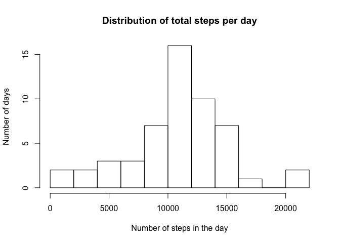
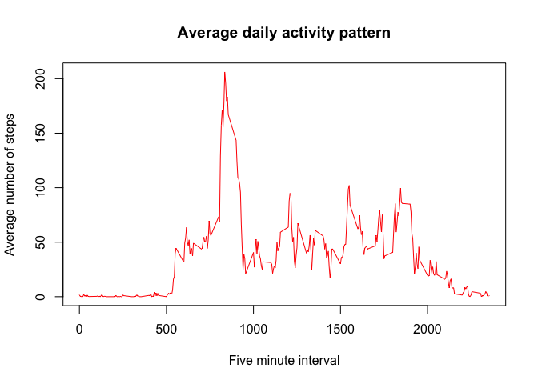
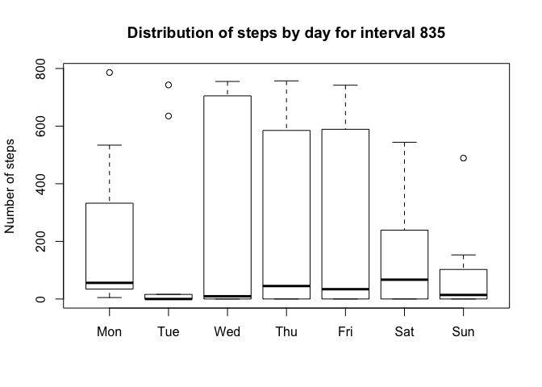
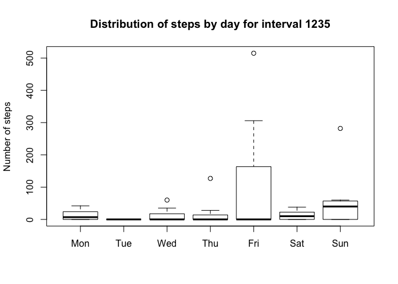
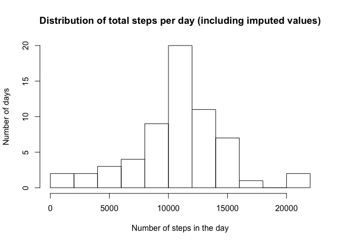
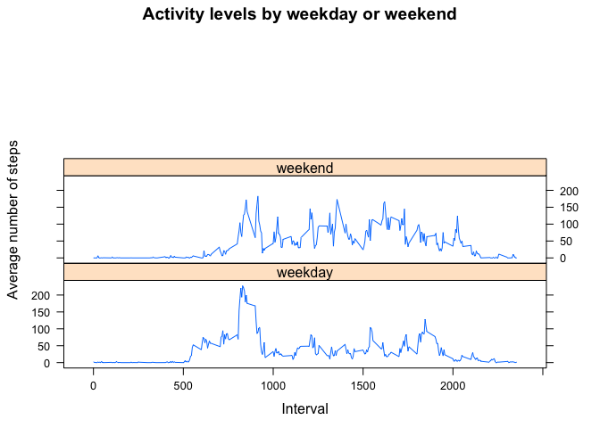

# Reproducible Research: Peer Assessment 1
## Introduction

This project involves some very basis data analysis and plotting of results.  I used both lattice and gplots, so the first step is to load these two packages. Also set the options so that the average number of steps will not be reported in scientific notation.


```r
library(gplots)
```

```
## Warning: package 'gplots' was built under R version 3.1.3
```

```
## 
## Attaching package: 'gplots'
## 
## The following object is masked from 'package:stats':
## 
##     lowess
```

```r
library(lattice)
options(scipen=1, digits=0)
```


## Loading and preprocessing the data

The data was downloaded from the course website and a day variable was added which was used to assign a weekend/weekday variable.  Note that the factor labels are assigned in numeric order, so that the '0' for the boolean needs to be set to 'weekday'.
I also split the data between those observations that had missing values and those that didn't.  


```r
activity <- read.csv("activity.csv")
activity$day <- weekdays(as.Date(activity$date))
activity$weekend <-  factor(activity$day %in% c("Sunday", "Saturday"), labels = c("weekday", "weekend"))

act.complete <- activity[complete.cases(activity),]
act.nas <- activity[is.na(activity$steps),]
```

The structure and first six observations of each dataset are shown below.

### act.complete


```r
str(act.complete)
```

```
## 'data.frame':	15264 obs. of  5 variables:
##  $ steps   : int  0 0 0 0 0 0 0 0 0 0 ...
##  $ date    : Factor w/ 61 levels "2012-10-01","2012-10-02",..: 2 2 2 2 2 2 2 2 2 2 ...
##  $ interval: int  0 5 10 15 20 25 30 35 40 45 ...
##  $ day     : chr  "Tuesday" "Tuesday" "Tuesday" "Tuesday" ...
##  $ weekend : Factor w/ 2 levels "weekday","weekend": 1 1 1 1 1 1 1 1 1 1 ...
```

```r
head(act.complete)
```

```
##     steps       date interval     day weekend
## 289     0 2012-10-02        0 Tuesday weekday
## 290     0 2012-10-02        5 Tuesday weekday
## 291     0 2012-10-02       10 Tuesday weekday
## 292     0 2012-10-02       15 Tuesday weekday
## 293     0 2012-10-02       20 Tuesday weekday
## 294     0 2012-10-02       25 Tuesday weekday
```

### act.nas


```r
str(act.nas)
```

```
## 'data.frame':	2304 obs. of  5 variables:
##  $ steps   : int  NA NA NA NA NA NA NA NA NA NA ...
##  $ date    : Factor w/ 61 levels "2012-10-01","2012-10-02",..: 1 1 1 1 1 1 1 1 1 1 ...
##  $ interval: int  0 5 10 15 20 25 30 35 40 45 ...
##  $ day     : chr  "Monday" "Monday" "Monday" "Monday" ...
##  $ weekend : Factor w/ 2 levels "weekday","weekend": 1 1 1 1 1 1 1 1 1 1 ...
```

```r
head(act.nas)
```

```
##   steps       date interval    day weekend
## 1    NA 2012-10-01        0 Monday weekday
## 2    NA 2012-10-01        5 Monday weekday
## 3    NA 2012-10-01       10 Monday weekday
## 4    NA 2012-10-01       15 Monday weekday
## 5    NA 2012-10-01       20 Monday weekday
## 6    NA 2012-10-01       25 Monday weekday
```


## What is mean total number of steps taken per day?

The total number of steps taken on each date can be calculated using the aggregate function.  


```r
steps.by.day <- aggregate(steps ~ date, data=act.complete,sum)
```

And the data can then be used to generate a histogram.


```r
hist(steps.by.day$steps, breaks =10, main="Distribution of total steps per day", xlab="Number of steps in the day", ylab="Number of days")
```

 

The average total number of steps in a day was 10766 while the median number of steps was 10765.  

## What is the average daily activity pattern?

The average number of steps per interval can also be calculated using the aggregate function. 


```r
steps.by.int <- aggregate(steps ~ interval, data=act.complete,mean)
```

and plotted on a line graph.  


```r
plot(steps.by.int$interval, steps.by.int$steps, type="l", col="red", main="Average daily activity pattern", xlab="Five minute interval", ylab="Average number of steps")
```

 

Use the which function to determine which interval contains the maximum average number of steps.  


```r
max.steps <- which(steps.by.int$steps==max(steps.by.int$steps))
low.lim.hrs <- steps.by.int[max.steps,1]%/%100
low.lim.mins <- steps.by.int[max.steps,1]%%100
up.lim.hrs <- (steps.by.int[max.steps,1]+5)%/%100
up.lim.mins <- (steps.by.int[max.steps,1]+5)%%100
```

The interval with the maximum average is from 8:35 to 8:40 and the average number of steps taken in that interval is 206


## Imputing missing values

I first made a box plot to check whether there appeared to be a difference between days.  In order to get the days to appear sequentially, I needed to create a factor variable for the day.  I then selected a number of intervals and made the boxplots.


```r
act.complete$day1 <- factor(act.complete$day, 
                           levels=c("Monday", "Tuesday", "Wednesday","Thursday", "Friday", "Saturday", "Sunday"), 
                           labels=c("Mon", "Tue", "Wed", "Thu",
                                    "Fri", "Sat", "Sun"))
boxplot(steps~day1, data=act.complete[act.complete$interval==835,], main="Distribution of steps by day for interval 835", ylab="Number of steps")
```

 

```r
boxplot(steps~day1, data=act.complete[act.complete$interval==1235,],main="Distribution of steps by day for interval 1235", ylab="Number of steps")
```

 

There appear to be clear differences between days.  Accordingly, impute the missing values by selecting randomly from the non-missing values for the equivalent day and interval.  The sample.steps function finds the relevant subset of observations and returns a random observation.  


```r
sample.steps <- function(day,interval){
      ss <- act.complete[act.complete$day==day&act.complete$interval==interval,]
      imp.steps<-ss[sample(length(ss),1),1]
      return(imp.steps)
}

act.nas$steps <- mapply(sample.steps, act.nas$day, act.nas$interval)

imp.act <- rbind(act.complete[,1:5], act.nas)
```

The original analysis can now be repeated on the dataset with the imputed values.


```r
imp.steps.by.day <- aggregate(steps ~ date, data=imp.act,sum)
hist(imp.steps.by.day$steps, breaks =10,main="Distribution of total steps per day (including imputed values)", xlab="Number of steps in the day", ylab="Number of days")
```

 

The average total number of steps in a day after imputing the missing values was 10725 while the median number of steps was 10765.  


## Are there differences in activity patterns between weekdays and weekends?

Using the weekend variable created in the initial data processing step, we can look at the differences in activity between weekdays and weekends.


```r
imp.steps.by.int <- aggregate(imp.act$steps, by = list(imp.act$weekend, imp.act$interval), mean)[,1:3]


xyplot(x ~ Group.2 | Group.1, data=imp.steps.by.int, type='l', layout=c(1,3), main="Activity levels by weekday or weekend", xlab="Interval", ylab="Average number of steps")
```

 

There are clear differences in the activity levels throughout the course of the day, with weekends involving considerably more activity, while weekdays show an obvious peak in the morning around 8:30.


